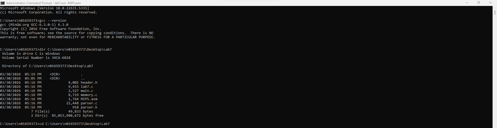
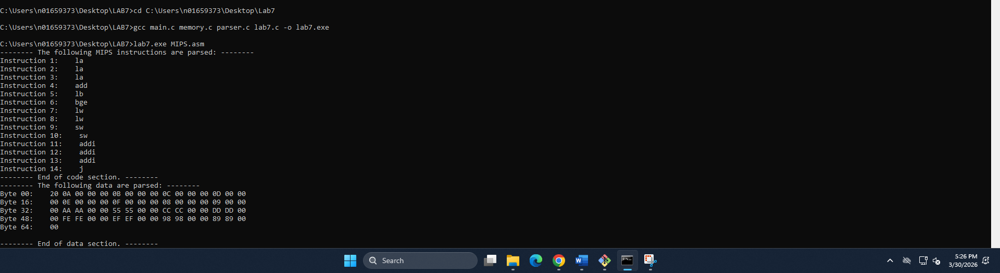
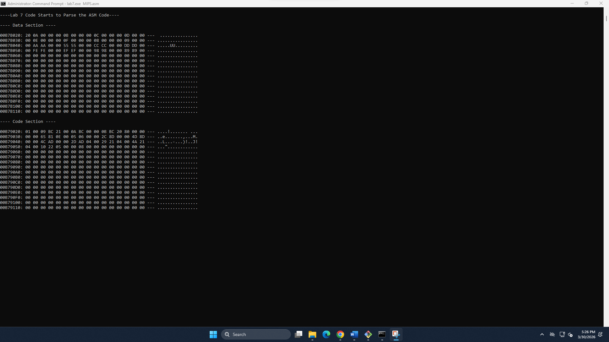

# CENG 356 - Lab 7: MIPS Architecture Design – Instruction Set

**Student:** Solomon Ewusi  
**Student ID:** N01659373  
**Course:** CENG 356 - Computer Systems Architecture  
**Institution:** Humber College  

---

## Overview
This lab simulates a MIPS computer architecture in C. The program reads a MIPS assembly file (MIPS.asm), parses it into data and instruction sections, converts each instruction into 32-bit machine code based on the MIPS instruction set, and loads everything into a simulated 1MB memory space.

---

## Files

| File | Description |
|------|-------------|
| `header.h` | Header file with macros, data structures and function declarations |
| `parser.h` | Header file for the MIPS assembly parser |
| `parser.c` | Parses the MIPS.asm file into data and instruction storage |
| `main.c` | Main entry point — reads the ASM file and launches the memory loader |
| `memory.c` | Memory controller — initializes memory with zeros, supports read/write/dump |
| `lab7.c` | Core Lab 7 implementation — converts MIPS instructions to machine code |
| `MIPS.asm` | MIPS assembly source file used as input to the simulator |

---

## Features Implemented

### 1. setupDataMemory()
Copies the `.data` section bytes from the parsed assembly into the memory space starting at offset `0x2000`.

### 2. buildIInstruction()
Builds a 32-bit I-type machine code word using the format:
```
oooooo sssss ttttt iiiiiiii iiiiiiii
[31:26] [25:21] [20:16] [15:0]
```
Used for: `la`, `lb`, `lw`, `sw`, `addi`, `bge`

### 3. buildJInstruction()
Builds a 32-bit J-type machine code word using the format:
```
oooooo iiiiiiii iiiiiiii iiiiiiii ii
[31:26] [25:0]
```
Used for: `j`

### 4. buildRInstruction()
Builds a 32-bit R-type machine code word using the format:
```
oooooo sssss ttttt ddddd aaaaa ffffff
[31:26] [25:21] [20:16] [15:11] [10:6] [5:0]
```
Used for: `add`

### 5. setupInstructionMemory()
Iterates through all parsed instructions, identifies each instruction type, assigns the correct opcode, builds the 32-bit machine code, and writes it to memory starting at offset `0x0000`.

### 6. loadCodeToMem()
Top-level function that calls `setupDataMemory()` and `setupInstructionMemory()`, then displays memory dumps of both sections.

---

## Instruction Encoding Reference

| Instruction | Type | Opcode |
|-------------|------|--------|
| `la` | I | `0b101111` |
| `lb` | I | `0b100000` |
| `lw` | I | `0b100011` |
| `sw` | I | `0b101011` |
| `addi` | I | `0b001000` |
| `bge` | I | `0b000001` |
| `add` | R | opcode=`0x00`, func=`0b100000` |
| `j` | J | `0b000010` |

---

## How to Compile & Run

### Requirements
- GCC (MinGW for Windows)

### Compile
```bash
gcc main.c memory.c parser.c lab7.c -o lab7.exe
```

### Run
```bash
lab7.exe MIPS.asm
```

---

## Screenshots

### Parsed Instructions & Data


### Data Section Memory Dump


### Code Section Memory Dump


---

## Notes
- Memory is initialized to **zero** in Lab 7+ (unlike Lab 6 which used random values)
- Data section starts at offset `0x2000` (8KB into memory)
- Code section starts at offset `0x0000` (beginning of memory)
- Little-endian byte ordering is used throughout

---

## GitHub Repository
[https://github.com/SolomonEwusi9373/SolomonEwusiCENG356-Lab7](https://github.com/SolomonEwusi9373/SolomonEwusiCENG356-Lab7)
